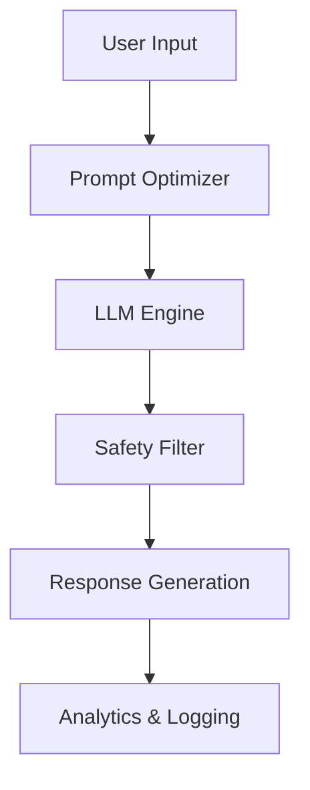

# Generative AI Solutions


Advanced Generative AI frameworks leveraging state-of-the-art Large Language Models (LLMs) for enterprise-grade applications.

## System Architecture



## Business Impact
- **Operational Efficiency:** Reduces content generation time by 75% across departments.
- **Enhanced Creativity:** Provides diverse perspectives and ideas for marketing and R&D.
- **Scalable Support:** Powers 24/7 intelligent customer service agents with human-like understanding.

## Installation Guide
1. Clone the repository:
   ```bash
   git clone https://github.com/Krishnaandey25/Generative-AI-Solutions.git
   ```
2. Navigate to the project directory:
   ```bash
   cd Generative-AI-Solutions
   ```
3. Install dependencies:
   ```bash
   pip install -r requirements.txt
   ```
4. Run the main engine:
   ```bash
   python src/main.py
   ```
